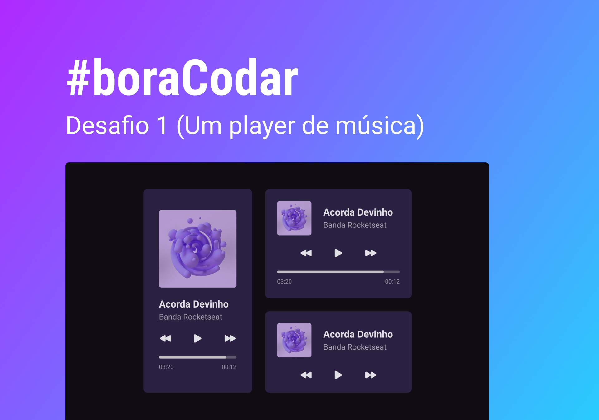

<h1 align="center"> #boraCodar Um player de música </h1>

#boraCodar é um evento semanal com desafios de programação, promovido pela Rocketseat para ensino de tecnologias WEB.  

  <a href="#-tecnologias">Tecnologias</a>&nbsp;&nbsp;&nbsp;|&nbsp;&nbsp;&nbsp;
  <a href="#-projeto">Projeto</a>&nbsp;&nbsp;&nbsp;|&nbsp;&nbsp;&nbsp;
  <a href="#-layout">Layout</a>&nbsp;&nbsp;&nbsp;

 

  

## 🚀 Tecnologias

Esse projeto foi desenvolvido com as seguintes tecnologias:

- HTML e CSS
- Git e Github
- Figma

## 💻 Projeto

Um player de música

- [Visite o projeto online](https://murilo-augusto.github.io/player-de-musica)

## 🔖 Layout

Você pode visualizar o layout do projeto através [DESSE LINK](https://www.figma.com/file/XnielIsj9qrix1qxAQLT9X/23boraCodar-Desafio-1). É necessário ter conta no [Figma](https://figma.com) para acessá-lo.
